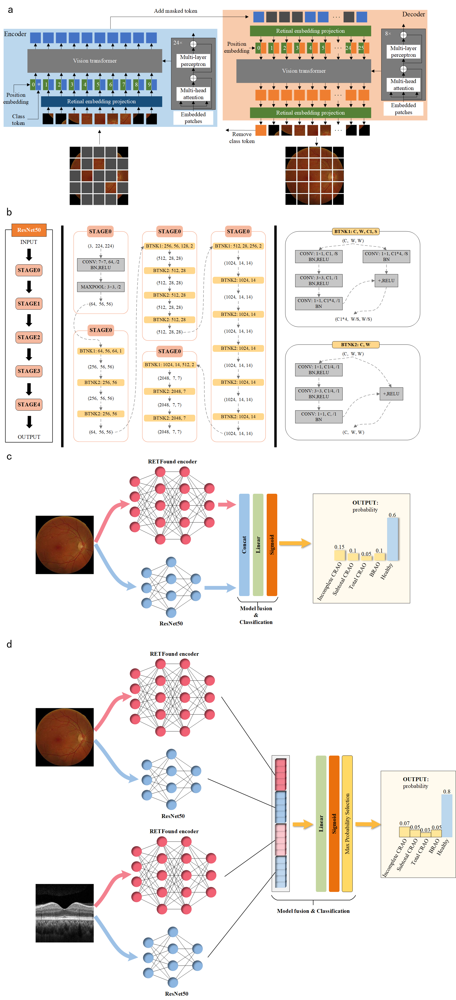

## Multi-model retina artery occlusion prediction using foundation model and small model fusion

```by Zhan Li, YiSong Han, YuNing Wang, QingLi Lu, Fan Ye, Yi Liao, SongDi Wu, QinRu Sun, ZiYe Mei, ZhongZhong Liu

```* **SAIL (Statistic Analysis And Intelligent Learning) Lab of NWU**

* We provide related codes and configuration files to reproduce the "Multi-model retina artery occlusion prediction using foundation model and small model fusion"

## Introduction
Our paper proposes three novel deep learning models, RAO-CFPNet, RAO-OCTNet, and RAO-MultiNet, to predict retinal artery occlusion (RAO) and its subtypes, which can be regarded as a combination of foundation model and small model fusion and the integration of multimodal (CFP and OCT) images.

<div align="center">
  
</div>


## Citation
```

```
## Download trained Weights
We provide the trained weights for RETFound, ResNet and RAO-Net models. You can download them from [Baidu Netdisk](https://pan.baidu.com/s/1Aq4f1MTz6OYbC188QqpX8g?pwd=7845) (extract code: 7845).

## Train
First, you need to train the model weights of RETFound and ResNet. If you already have the trained weights of RETFound and ResNet, you can enter "python train_single_fusion.py" or "python train_multi_fusion.py" to run the code. If you are prompted that certain packages are missing, enter "pip install * *" to install the dependent packages.

## Inference
After training, you can use the python test_single_fusion.py or test_multi_fusion.py to validate your model.

